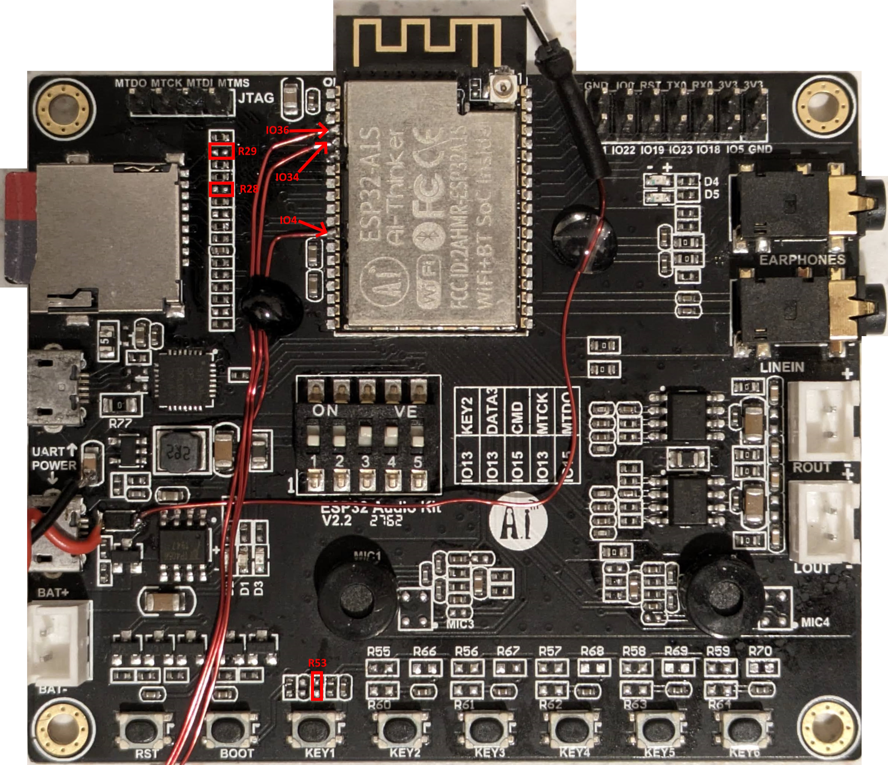

# ESP32-MiniWebRadio V2 with Rotary Encoder support
based on <a href="https://github.com/schreibfaul1/ESP32-MiniWebRadio">ESP32-MiniWebRadio V2</a> by @[schreibfaul1](https://github.com/schreibfaul1)


**Additional feature description**

A rotary encoder is used for setting volume and choosing stations. In this use case, only Internet Radio mode is used. The reason for a rotary encoder (or physical UI elements in general) is better system response and usability in my opinion. The goal was to add the rotary encoder to the (great working) existing system while current user input via touchscreen is still possible.

**Used hardware in this case**
<ul>
<li>AI-Thinker ESP32-A1S Audiokit development board</li>
<li>TFT Display with Touchpad (SPI) ILI9486 (480x320px) (Raspberry Pi style)</li>
<li>KY-040 Rotary Encoder module, like <a href="https://www.amazon.de/gp/product/B079H3C98M/ref=ppx_yo_dt_b_search_asin_title?ie=UTF8&psc=1">this</a> or <a href="https://www.aliexpress.com/item/32790788377.html?spm=a2g0o.productlist.main.37.608764fdDN9aeJ&algo_pvid=baf94bfe-c75e-4d30-9a6f-6201872b6daf&algo_exp_id=baf94bfe-c75e-4d30-9a6f-6201872b6daf-18&pdp_npi=4%40dis%21EUR%210.58%210.51%21%21%210.62%210.55%21%402101effb17060202289143107eb6c4%2112000037069013103%21sea%21AT%21701706746%21&curPageLogUid=KQkBQiDhZ6ex&utparam-url=scene%3Asearch%7Cquery_from%3A">this</a><br>
Note: I observed that on some modules one of the 3 pullup resistors are not populated. This resulted in poor results when reading the button state. I therefore recommend populating this resistor (e.g. 10k) or at least thinking about it if problems arise with the detection of the key press.
See picture of the <a href="additional_info/MiniWebRadioV2KY040Rear.jpg">Encoder bottom PCB side</a>.</li>  
<li>no IR receiver is used, there is no free GPIO left</li>
</ul>

**Hardware modification**
Unfortunately the number of usable GPIOs is very limited on this board. To free up 3 GPIOs for the rotary encoder, the following modifications were made to the board:
<ul>
<li>Removed R53, which isolates IO36 from pullup resistors and debouncing cap</li>
<li>Removed R29, which isolates IO34 from sd card reader (normally used for SD detect, which is not needed in this project)</li>
<li>Removed R28, which isolates IO4 from sd card reader (normally used for SD data1 line, which is not needed in this project)</li>
<li>connected wires to IO4, IO34 and IO36 directly at the module pads - this was the easiest way for me</li>
</ul>




**Software**

I've used [this](https://github.com/igorantolic/ai-esp32-rotary-encoder) library from @[Igor](https://github.com/igorantolic) for the encoder. The pinout is defined in the macro section of common.h with the following lines: 
```
#define ROTARY_ENCODER_A_PIN 34
#define ROTARY_ENCODER_B_PIN 36
#define ROTARY_ENCODER_BUTTON_PIN 4
#define ROTARY_ENCODER_STEPS 4
```
If you want to change the direction of the encoder, just swap DT/CLK pins in software or hardware.
If you encounter issues with readings, you may tweak the `ROTARY_ENCODER_STEPS` value. More information is found in the documentation of the rotary encoder library. 


**Cabling**

Rotary Module Pin | AI Thinker ESP32-A1S Audiokit | Comment |
|----------|----------|----------|
| GND | GND | via GPIO header |
| 3.3V | 3.3V |  via GPIO header |
| SW | IO4 | via wire soldered to module (see remarks above) |
| DT | IO34 | via wire soldered to module (see remarks above) |
| CLK | IO36 | via wire soldered to module (see remarks above) |

[Rotary Module Pinout](additional_info/MiniWebRadioV2KY040Pinout.jpg)
